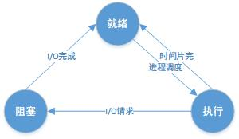

# 并发

## 进程

**进程是一个具有独立功能的程序关于某个数据集合的一次运行活动。它可以申请和拥有系统资源，是一个动态的概念，是一个活动的实体。它不只是程序的代码，还包括当前的活动，通过程序计数器的值和处理寄存器的内容来表示**。

进程的概念主要有两点：

  - `进程是一个实体`，**每一个进程都有它自己的地址空间，一般情况下，包括文本区域（text region）、数据区域（data region）和堆栈（stack region）**。文本区域存储处理器执行的代码；数据区域存储变量和进程执行期间使用的动态分配的内存；堆栈区域存储着活动过程调用的指令和本地变量。
  - `进程是一个“执行中的程序”`，程序是一个没有生命的实体，只有处理器赋予程序生命时，它才能成为一个活动的实体，我们称其为进程。

### 进程的基本状态

  - `阻塞态`：等待某个事件的完成；
  - `就绪态`：等待系统分配处理器以便运行；
  - `执行态`：占有处理器正在运行。



>执行态 -> 阻塞态：往往是由于等待外设，等待主存等资源分配或等待人工干预而引起的。

>阻塞态 -> 就绪态：则是等待的条件已满足，只需分配到处理器后就能运行。

>执行态 -> 就绪态：不是由于自身原因，而是由外界原因使运行状态的进程让出处理器，这时候就变成就绪态。例如时间片用完，或有更高优先级的进程来抢占处理器等。

>就绪态 -> 执行态：系统按某种策略选中就绪队列中的一个进程占用处理器，此时就变成了运行态


### 进程调度

#### 调度种类

高级、中级和低级调度作业从提交开始直到完成，往往要经历下述三级调度：

  - 高级调度：又称为作业调度，它决定把后备作业调入内存运行；
  - 中级调度：又称为在虚拟存储器中引入，在内、外存对换区进行进程对换。
  - 低级调度：又称为进程调度，它决定把就绪队列的某进程获得CPU；

#### 非抢占式调度与抢占式调度

  - `非抢占式`：分派程序一旦把处理机分配给某进程后便让它一直运行下去，直到进程完成或发生进程调度进程调度某事件而阻塞时，才把处理机分配给另一个进程。

  - `抢占式`：操作系统将正在运行的进程强行暂停，由调度程序将CPU分配给其他就绪进程的调度方式。

#### 调度策略的设计

  - `响应时间`：从用户输入到产生反应的时间
  - `周转时间`：从任务开始到任务结束的时间
  - `平均周转时间`：周转总时间除以作业个数

CPU任务可以分为交互式任务和批处理任务，调度最终的目标是合理的使用CPU，使得交互式任务的响应时间尽可能短，用户不至于感到延迟，同时使得批处理任务的周转时间尽可能短，减少用户等待的时间。

#### 调度算法

1. FCFS：调度的顺序就是任务到达就绪队列的顺序。对短作业不公平。

  >公平、简单(FIFO队列)、非抢占、不适合交互式。未考虑任务特性，平均等待时间可以缩短

2. SJF：最短的作业(CPU区间长度最小)最先调度。

  >可以证明，SJF可以保证最小的平均等待时间。

  - SRJF：SJF的可抢占版本，比SJF更有优势。

  SJF(SRJF): 如何知道下一CPU区间大小？根据历史进行预测: 指数平均法。

3. HRN：最高响应比优先法，是FCFS和SJF的综合平衡，响应比R定义如下： `R =(W+T)/T` 。

4. 优先权调度：每个任务关联一个优先权，调度优先权最高的任务。

  >注意：优先权太低的任务一直就绪，得不到运行，出现“饥饿”现象。

  FCFS是RR的特例，SJF是优先权调度的特例。这些调度算法都不适合于交互式系统。

5. Round-Robin(RR)：设置一个时间片，按时间片来轮转调度

  优点: 定时有响应，等待时间较短；缺点: 上下文切换次数较多；

  > 时间片太大，响应时间太长；吞吐量变小，周转时间变长；当时间片过长时，退化为FCFS。

6. 多级队列调度

  - 按照一定的规则建立多个进程队列
  - 不同的队列有固定的优先级（高优先级有抢占权）
  - 不同的队列可以给不同的时间片和采用不同的调度方法

  >存在问题1：没法区分I/O bound和CPU bound；

  >存在问题2：也存在一定程度的“饥饿”现象；

7. 多级反馈队列：在多级队列的基础上，任务可以在队列之间移动，更细致的区分任务。可以根据“享用”CPU时间多少来移动队列，阻止“饥饿”。

  >最通用的调度算法，多数OS都使用该方法或其变形，如UNIX、Windows等。

### 进程同步

#### 临界资源与临界区

在操作系统中，**进程是占有资源的最小单位（线程可以访问其所在进程内的所有资源，但线程本身并不占有资源或仅仅占有一点必须资源）**。但对于某些资源来说，其在同一时间只能被一个进程所占用。这些一次只能被一个进程所占用的资源就是所谓的临界资源。典型的临界资源比如物理上的打印机，或是存在硬盘或内存中被多个进程所共享的一些变量和数据等(如果这类资源不被看成临界资源加以保护，那么很有可能造成丢数据的问题)。

对于临界资源的访问，必须是互斥进行。也就是当临界资源被占用时，另一个申请临界资源的进程会被阻塞，直到其所申请的临界资源被释放。而进程内访问临界资源的代码被成为临界区。

对于临界区的访问过程分为四个部分：

  1. 进入区:查看临界区是否可访问，如果可以访问，则转到步骤二，否则进程会被阻塞
  2. 临界区:在临界区做操作
  3. 退出区:清除临界区被占用的标志
  4. 剩余区：进程与临界区不相关部分的代码

解决临界区问题可能的方法：

  1. 一般软件方法
  2. 关中断方法
  3. 硬件原子指令方法
  4. 信号量方法

#### 信号量

信号量是一个确定的二元组（s，q），其中s是一个具有非负初值的整形变量，q是一个初始状态为空的队列，整形变量s表示系统中某类资源的数目：

- 当其值 >= 0 时，表示系统中当前可用资源的数目
- 当其值 < 0 时，其绝对值表示系统中因请求该类资源而被阻塞的进程数目

除信号量的初值外，信号量的值仅能由P操作和V操作更改，操作系统利用它的状态对进程和资源进行管理

##### P操作

P操作记为P(s)，其中s为一信号量，它执行时主要完成以下动作：

```
s.value = s.value - 1；  /*可理解为占用1个资源，若原来就没有则记帐“欠”1个*/
```

若s.value ≥ 0，则进程继续执行，否则（即s.value < 0），则进程被阻塞，并将该进程插入到信号量s的等待队列s.queue中

> 实际上，P操作可以理解为分配资源的计数器，或是使进程处于等待状态的控制指令

##### V操作

V操作记为V(s)，其中s为一信号量，它执行时，主要完成以下动作：

```
s.value = s.value + 1；/*可理解为归还1个资源，若原来就没有则意义是用此资源还1个欠帐*/
```

若s.value > 0，则进程继续执行，否则（即s.value ≤ 0）,则从信号量s的等待队s.queue中移出第一个进程，使其变为就绪状态，然后返回原进程继续执行

> 实际上，V操作可以理解为归还资源的计数器，或是唤醒进程使其处于就绪状态的控制指令      

#### 锁

  - 互斥锁：同一时间只能有一个线程访问加锁的数据。
  - 自旋锁：互斥锁的一种实现，如果自旋锁已经被别的执行单元保持，调用者就一直 **循环等待** 是否该自旋锁的保持者已经释放了锁。
  - 读写锁：一种特殊的自旋锁，它把对共享资源的访问者划分成读者和写者，读者只对共享资源进行读访问，写者则需要对共享资源进行写操作。**写者是排他性的，一个读写锁同时只能有一个写者或多个读者（与CPU数相关），但不能同时既有读者又有写者**。
  - 阻塞锁：与自旋锁不同，改变了线程的运行状态。**让线程进入阻塞状态进行等待，当获得相应的信号（唤醒，时间） 时，才可以进入线程的准备就绪状态**，准备就绪状态的所有线程，通过竞争，进入运行状态。

  > 在Java中synchronized,ReentrantLock,Object.wait() / notify()都属于阻塞锁。

  - 可重入锁：也叫做递归锁，指的是同一线程上该锁是可重入的，对于不同线程则相当于普通的互斥锁。
  - 公平锁：加锁前检查是否有排队等待的线程，优先排队等待的线程，先来先得。
  - 非公平锁：加锁时不考虑排队等待问题，直接尝试获取锁，获取不到自动到队尾等待。`ReentrantLock`中的`lock()`默认就是非公平锁。
  - 悲观锁：假定会发生并发冲突，屏蔽一切可能违反数据完整性的操作。加锁的时间可能会很长，也就是说悲观锁的并发访问性不好。
  - 乐观锁：假设不会发生并发冲突，只在提交操作时检查是否违反数据完整性。乐观锁不能解决脏读的问题，可以通过添加时间戳和版本来来解决。

##### CAS

**比较并交换(compare and swap, CAS)**，是原子操作的一种，可用于在多线程编程中实现不被打断的数据交换操作。**该操作通过将内存中的值与指定数据进行比较，当数值一样时将内存中的数据替换为新的值**。

在使用上，通常会记录下某块内存中的旧值，通过对旧值进行一系列的操作后得到新值，然后通过CAS操作将新值与旧值进行交换。**如果这块内存的值在这期间内没被修改过，则旧值会与内存中的数据相同，这时CAS操作将会成功执行使内存中的数据变为新值**。如果内存中的值在这期间内被修改过，则一般来说旧值会与内存中的数据不同，这时CAS操作将会失败，新值将不会被写入内存。

#### 死锁

死锁是指多个进程因循环等待资源而造成无法执行的现象。死锁会造成进程无法执行，同时会造成系统资源的极大浪费(资源无法释放)。

##### 死锁产生的四个必要条件

  - `互斥使用`：指进程对所分配到的资源进行排它性使用，即在一段时间内某资源只由一个进程占用。如果此时还有其它进程请求资源，则请求者只能等待，直至占有资源的进程用毕释放。

  - `不可抢占`：指进程已获得的资源，在未使用完之前，不能被剥夺，只能在使用完时由自己释放。

  - `请求和保持`：指进程已经保持至少一个资源，但又提出了新的资源请求，而该资源已被其它进程占有，此时请求进程阻塞，但又对自己已获得的其它资源保持不放。

  - `循环等待`：指在发生死锁时，必然存在一个进程——资源的环形链，即进程集合{P0，P1，P2，···，Pn}中的P0正在等待一个P1占用的资源；P1正在等待P2占用的资源，……，Pn正在等待已被P0占用的资源。

##### 死锁避免

银行家算法：判断此次请求是否造成死锁若会造成死锁，则拒绝该请求。

### 进程间通信

本地进程间通信的方式有很多，可以总结为下面四类：

  - 消息传递（管道、FIFO、消息队列）
  - 同步（互斥量、条件变量、读写锁、文件和写记录锁、信号量）
  - 共享内存（匿名的和具名的）
  - 远程过程调用（Solaris门和Sun RPC）

## 线程

线程，有时被称为轻量级进程(Lightweight Process，LWP），是程序执行流的最小单元。一个标准的线程由线程ID，当前指令指针(PC），寄存器集合和堆栈组成。

线程具有以下属性：

  - `轻型实体`：线程中的实体基本上不拥有系统资源，只是有一点必不可少的、能保证独立运行的资源。线程的实体包括程序、数据和TCB。线程是动态概念，它的动态特性由线程控制块TCB（Thread Control Block）描述。TCB包括以下信息：

    - 线程状态。
    - 当线程不运行时，被保存的现场资源。
    - 一组执行堆栈。
    - 存放每个线程的局部变量主存区。
    - 访问同一个进程中的主存和其它资源。

    用于指示被执行指令序列的程序计数器、保留局部变量、少数状态参数和返回地址等的一组寄存器和堆栈。

  - `独立调度和分派的基本单位`：在多线程OS中，线程是能独立运行的基本单位，因而也是独立调度和分派的基本单位。由于线程很“轻”，故线程的切换非常迅速且开销小（在同一进程中的）。

  - `可并发执行`：在一个进程中的多个线程之间，可以并发执行，甚至允许在一个进程中所有线程都能并发执行；同样，不同进程中的线程也能并发执行，充分利用和发挥了处理机与外围设备并行工作的能力。

  - `共享进程资源`：在同一进程中的各个线程，都可以共享该进程所拥有的资源，这首先表现在：所有线程都具有相同的地址空间（进程的地址空间），这意味着，线程可以访问该地址空间的每一个虚地址；此外，还可以访问进程所拥有的已打开文件、定时器、信号量机构等。由于同一个进程内的线程共享内存和文件，所以线程之间互相通信不必调用内核。

  > 线程共享的环境包括：进程代码段、进程的公有数据(利用这些共享的数据，线程很容易的实现相互之间的通讯)、进程打开的文件描述符、信号的处理器、进程的当前目录和进程用户ID与进程组ID。

线程是程序执行的一条路径，在多线程的OS中，线程是调度和分配的基本单位，而进程是拥有资源的基本单位。

## 协程

协程，又称微线程，纤程。英文名Coroutine。

协程可以理解为用户级线程，协程和线程的区别是：**线程是抢占式的调度，而协程是协同式的调度，协程避免了无意义的调度，由此可以提高性能，但也因此，程序员必须自己承担调度的责任，同时，协程也失去了标准线程使用多CPU的能力**。

## IO多路复用

### 基本概念

IO多路复用是指内核一旦发现进程指定的一个或者多个IO条件准备读取，它就通知该进程。IO多路复用适用如下场合：

  - 当客户处理多个描述字时（一般是交互式输入和网络套接口），必须使用I/O复用。
  - 当一个客户同时处理多个套接口时，而这种情况是可能的，但很少出现。
  - 如果一个TCP服务器既要处理监听套接口，又要处理已连接套接口，一般也要用到I/O复用。
  - 如果一个服务器即要处理TCP，又要处理UDP，一般要使用I/O复用。
  - 如果一个服务器要处理多个服务或多个协议，一般要使用I/O复用。

与多进程和多线程技术相比，I/O多路复用技术的最大优势是系统开销小，系统不必创建进程/线程，也不必维护这些进程/线程，从而大大减小了系统的开销。

### 常见的IO复用实现

- select(Linux/Windows/BSD)
- epoll(Linux)
- kqueue(BSD/Mac OS X)
