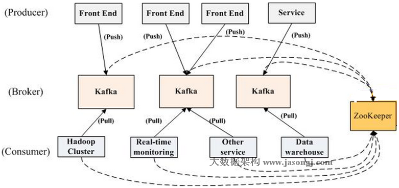
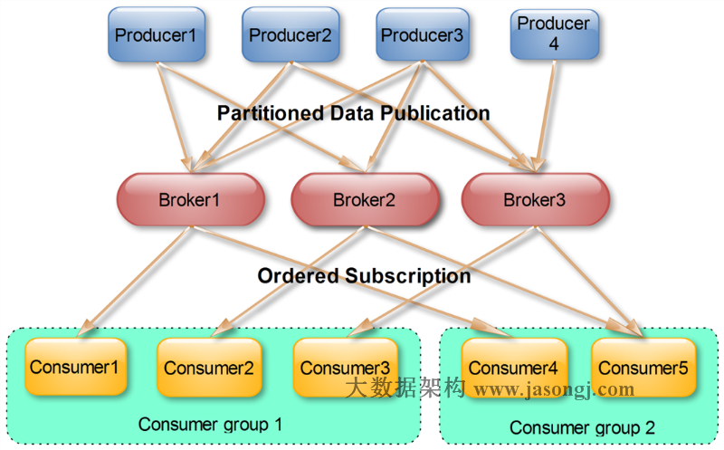
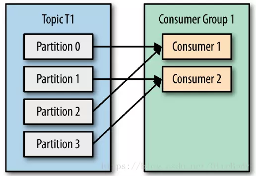
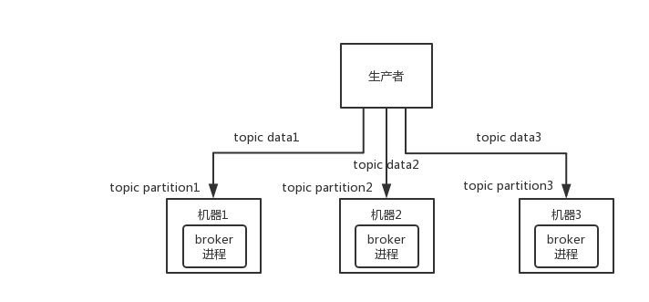
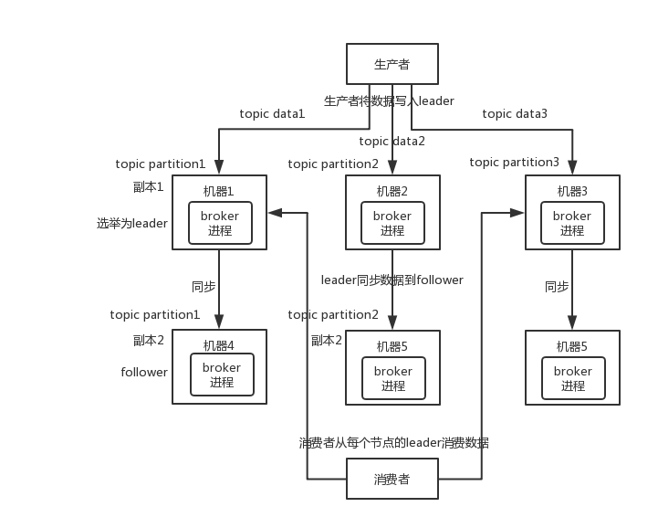
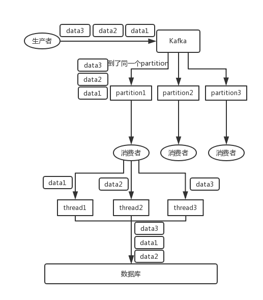
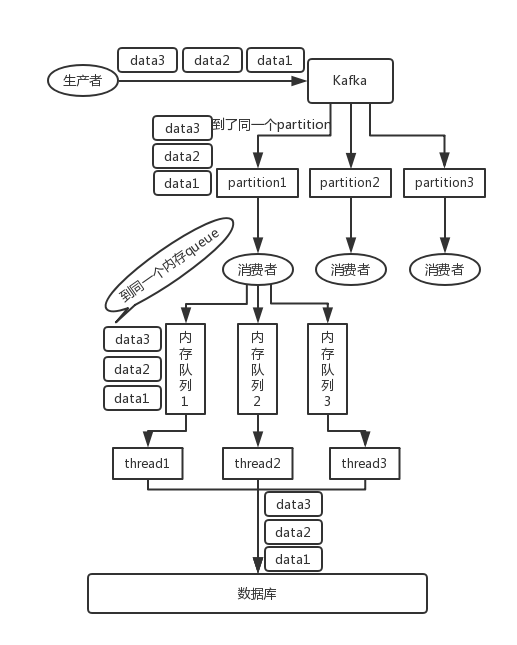

# Kafka

## 术语

  - **Broker**：Kafka 集群包含一个或多个服务器，这种服务器被称为 `broker` 。
  - **Topic**：每条发布到 Kafka 集群的消息都有一个类别，这个类别被称为 Topic。（物理上不同 Topic 的消息分开存储，逻辑上一个 Topic 的消息虽然保存于一个或多个 broker 上，但用户只需指定消息的 Topic 即可生产或消费数据而不必关心数据存于何处）。
  - **Partition**： `Partition` 是物理上的概念，每个 `Topic` 包含一个或多个 `Partition` 。
  - **Producer**：负责发布消息到 Kafka broker。
  - **Consumer**：消息消费者，向 Kafka broker 读取消息的客户端。
  - **Consumer Group**：每个 `Consumer` 属于一个特定的 `Consumer Group`（可为每个 Consumer 指定 group name，若不指定 group name 则属于默认的 group）。

## 拓扑结构

如上图所示，一个典型的 `Kafka` 集群中包含若干 `Producer` （可以是web前端产生的Page View，或者是服务器日志，系统CPU、Memory等），若干 `broker` （Kafka支持水平扩展，一般broker数量越多，集群吞吐率越高），若干 `Consumer Group` ，以及一个 `Zookeeper` 集群。 `Kafka` 通过 `Zookeeper` 管理集群配置，选举 `leader` ，以及在 `Consumer Group` 发生变化时进行 rebalance。 `Producer` 使用 push 模式将消息发布到broker，Consumer使用pull模式从broker订阅并消费消息。

## Topic & Partition

**Topic 在逻辑上可以被认为是一个 queue** ，每条消费都必须指定它的 `Topic` ，可以简单理解为必须指明把这条消息放进哪个 `queue` 里。为了使得 Kafka 的吞吐率可以线性提高，**物理上把 `Topic` 分成一个或多个 `Partition`** ，每个 `Partition` 在物理上对应一个文件夹，该文件夹下存储这个 `Partition` 的所有消息和索引文件。若创建 `topic1` 和 `topic2` 两个 `topic` ，且分别有 13 个和 19 个分区，则整个集群上会相应会生成共 32 个文件夹（本文所用集群共8个节点，此处 `topic1` 和 `topic2` `replication-factor` 均为1）。

> Partition 都是通过 顺序读写，所以效率很高

> replication-factor 配置 partition 副本数。配置副本之后,每个 partition 都有一个唯一的 leader ，有 0 个或多个 follower 。所有的读写操作都在 leader 上完成，followers 从 leader 消费消息来复制 message，就跟普通的 consumer 消费消息一样。一般情况下 partition 的数量大于等于 broker 的数量，并且所有 partition 的 leader 均匀分布在 broker 上。

对于传统的 MQ 而言，一般会删除已经被消费的消息，而 Kafka 集群会保留所有的消息，无论其被消费与否。当然，因为磁盘限制，不可能永久保留所有数据（实际上也没必要），因此 Kafka 提供两种策略删除旧数据。一是基于时间，二是基于 Partition 文件大小。

## Producer 消息路由

Producer 发送消息到 broker 时，会根据 Paritition 机制选择将其存储到哪一个 Partition 。如果 Partition 机制设置合理，所有消息可以均匀分布到不同的 Partition 里，这样就实现了负载均衡。如果一个 Topic 对应一个文件，那这个文件所在的机器I/O将会成为这个 Topic 的性能瓶颈，而有了 Partition 后，不同的消息可以并行写入不同 broker 的不同 Partition 里，极大的提高了吞吐率。

可以在 `$KAFKA_HOME/config/server.properties` 中通过配置项 `num.partitions` 来指定新建 `Topic` 的默认 `Partition` 数量，也可在创建 `Topic` 时通过参数指定，同时也可以在 Topic 创建之后通过 Kafka 提供的工具修改。

- 指定了 patition，则直接使用
- 未指定 patition 但指定 key，通过对 key 进行 hash 选出一个 patition
- patition 和 key 都未指定，使用轮询选出一个 patition

## Consumer Group

这是 Kafka 用来实现一个 Topic 消息的广播（发给所有的 Consumer ）和单播（发给某一个 Consumer ）的手段。一个 Topic 可以对应多个 Consumer Group 。如果需要实现广播，只要每个 Consumer 有一个独立的 Group 就可以了。要实现单播只要所有的 Consumer 在同一个 Group 里。用 Consumer Group 还可以将 Consumer 进行自由的分组而不需要多次发送消息到不同的 Topic 。

## Consumer 个数与 Parition 数有什么关系？

**topic 下的一个分区只能被同一个 consumer group 下的一个 consumer 线程来消费**，但反之并不成立，即一个 consumer 线程可以消费多个分区的数据。比如 Kafka 提供的 `ConsoleConsumer` ，默认就只是一个线程来消费所有分区的数据。

> 即分区数决定了同组消费者个数的上限

所以，如果你的分区数是 N ，那么最好线程数也保持为 N ，这样通常能够达到最大的吞吐量。超过 N 的配置只是浪费系统资源，因为多出的线程不会被分配到任何分区。

- 如果消费线程大于 patition 数量，则有些线程将收不到消息
- 如果 patition 数量大于消费线程数，则有些线程多收到多个 patition 的消息
- 如果一个线程消费多个 patition，则无法保证你收到的消息的顺序，而一个 patition 内的消息是有序的

## Push vs. Pull　　

作为一个消息系统，Kafka 遵循了传统的方式，选择由 Producer 向 broker `push` 消息并由 Consumer 从 broker `pull` 消息。事实上，push 模式和 pull 模式各有优劣。

  - Push模式 很难适应消费速率不同的消费者，因为消息发送速率是由broker决定的。push模式的目标是尽可能以最快速度传递消息，但是这样很容易造成 Consumer 来不及处理消息，典型的表现就是拒绝服务以及网络拥塞。
  - Pull模式 可以根据Consumer的消费能力以适当的速率消费消息。

对于 Kafka 而言，Pull模式 更合适。Pull模式 可简化 broker 的设计，Consumer 可自主控制消费消息的速率，同时 Consumer 可以自己控制消费方式——即可批量消费也可逐条消费，同时还能选择不同的提交方式从而实现不同的传输语义。

## 高可用性

`Kafka 0.8` 以前，是没有 HA 机制的，就是任何一个 `broker` 宕机了，那个 `broker` 上的 `partition` 就废了，没法写也没法读，没有什么高可用性可言。

比如说，我们假设创建了一个 `topic` ，指定其 `partition` 数量是 `3` 个，分别在三台机器上。但是，如果第二台机器宕机了，会导致这个 `topic` 的 `1/3` 的数据就丢了，因此这个是做不到高可用的。

`Kafka 0.8` 以后，提供了 `HA` 机制，就是 `replica` **副本机制**。每个 `partition` 的数据都会同步到其它机器上，形成自己的多个 `replica` 副本。所有 `replica` 会选举一个 `leader` 出来，那么生产和消费都跟这个 `leader` 打交道，然后其他 `replica` 就是 `follower` 。写的时候， `leader` 会负责把数据同步到所有 `follower` 上去，读的时候就直接读 `leader` 上的数据即可。 `Kafka` 会均匀地将一个 `partition` 的所有 `replica` 分布在不同的机器上，这样才可以提高容错性。

这么搞，就有所谓的高可用性了，因为如果某个 `broker` 宕机了，没事儿，那个 `broker` 上面的 `partition` 在其他机器上都有副本的，如果这上面有某个 `partition` 的 `leader` ，那么此时会从 `follower` 中 **重新选举** 一个新的 `leader` 出来，大家继续读写那个新的 `leader` 即可。这就有所谓的高可用性了。

  - **写数据** 的时候，生产者就写 `leader` ，然后 `leader` 将数据落地写本地磁盘，接着其他 `follower` 自己主动从 `leader` 来 `pull` 数据。一旦所有 `follower` 同步好数据了，就会发送 `ack` 给 `leader` ， **`leader` 收到所有 `follower` 的 `ack` 之后，就会返回写成功的消息给生产者**。（当然，这只是其中一种模式，还可以适当调整这个行为）
  - **消费** 的时候，只会从 `leader` 去读，但是 **只有当一个消息已经被所有 `follower` 都同步成功返回 `ack` 的时候，这个消息才会被消费者读到**。

## 消息幂等性

`Kafka` 实际上有个 `offset` 的概念，就是每个消息写进去，都有一个 `offset` ，代表消息的序号，然后 **`consumer` 消费了数据之后，每隔一段时间（定时定期），会把自己消费过的消息的 `offset` 提交一下**，表示“我已经消费过了，下次我要是重启啥的，你就让我继续从上次消费到的 `offset` 来继续消费吧”。

但是凡事总有意外，比如我们之前生产经常遇到的，就是你有时候重启系统，看你怎么重启了，如果碰到点着急的，直接 `kill` 进程了，再重启。这会导致 `consumer` 有些消息处理了，但是没来得及提交 `offset` ，尴尬了。重启之后，**少数消息会再次消费一次**。

幂等性，通俗点说，**一个数据，或者一个请求，给你重复来多次，你得确保对应的数据是不会改变的，不能出错**。其实重复消费不可怕，可怕的是你没考虑到重复消费之后，怎么保证幂等性？其实还是得 **结合业务来思考**，这里给几个思路：
  - 比如你拿个数据要写库，你先根据主键查一下，如果这数据都有了，你就别插入了，update 一下好吧。
  - 比如你是写 Redis ，那没问题了，反正每次都是 set，天然幂等性。
  - 比如你不是上面两个场景，那做的稍微复杂一点，你需要让生产者发送每条数据的时候，里面加一个全局唯一的 id，类似订单 id 之类的东西，然后你这里消费到了之后，先根据这个 id 去比如 Redis 里查一下，之前消费过吗？如果没有消费过，你就处理，然后这个 id 写 Redis。如果消费过了，那你就别处理了，保证别重复处理相同的消息即可。
  - 比如基于数据库的唯一键来保证重复数据不会重复插入多条。因为有唯一键约束了，重复数据插入只会报错，不会导致数据库中出现脏数据。

## 消息丢失

### 消费端弄丢了数据

唯一可能导致消费者弄丢数据的情况，就是说，你消费到了这个消息，然后消费者那边 **自动提交了 `offset`** ，让 `Kafka` 以为你已经消费好了这个消息，但其实你才刚准备处理这个消息，你还没处理，你自己就挂了，此时这条消息就丢咯。

`Kafka` 会自动提交 `offset` ，那么只要关闭自动提交 `offset` ，在处理完之后自己手动提交 `offset` ，就可以保证数据不会丢。但是此时确实还是可能会有重复消费，比如你刚处理完，还没提交 `offset` ，结果自己挂了，此时肯定会重复消费一次，自己 **保证幂等性** 就好了。

### Kafka 弄丢了数据

这块比较常见的一个场景，就是 `Kafka` 某个 `broker` 宕机，然后重新选举 `partition` 的 `leader` 。大家想想，要是此时其他的 `follower` 刚好还有些数据没有同步，结果此时 `leader` 挂了，然后选举某个 `follower` 成 `leader` 之后，不就少了一些数据？这就丢了一些数据啊。

此时一般是要求起码设置如下 4 个参数：
  - 给 `topic` 设置 `replication.factor` 参数：这个值必须大于 1，要求每个 `partition` 必须有 **至少** 2 个副本。
  - 在 `Kafka` 服务端设置 `min.insync.replicas` 参数：这个值必须大于 1，这个是 **要求一个 `leader` 至少感知到有至少一个 `follower` 还跟自己保持联系**，没掉队，这样才能确保 `leader` 挂了还有一个 `follower` 吧。
  - 在 `producer` 端设置 `acks=all`：这个是要求每条数据，**必须是写入所有 `replica` 之后，才能认为是写成功了**。
  - 在 `producer` 端设置 `retries=MAX`（很大很大很大的一个值，无限次重试的意思）：这个是要求 **一旦写入失败，就无限重试**，卡在这里了。

这样配置之后，至少在 Kafka `broker` 端就可以保证在 `leader` 所在 `broker` 发生故障，进行 `leader` 切换时，数据不会丢失。

### 生产者会不会弄丢数据？

如果按照上述的思路设置了 `acks=all`，一定不会丢，要求是，你的 `leader` 接收到消息，所有的 `follower` 都同步到了消息之后，才认为本次写成功了。如果没满足这个条件，生产者可以自动不断的重试，重试无限次。

## 消息的顺序性

比如说我们建了一个 `topic` ，有三个 `partition` 。生产者在写的时候，其实可以指定一个 `key` ，比如说我们指定了某个订单 `id` 作为 `key` ，那么这个订单相关的数据，一定会被分发到同一个 `partition` 中去，而且这个 `partition` 中的数据一定是有顺序的。

消费者从 `partition` 中取出来数据的时候，也一定是有顺序的。到这里，顺序还是 `ok` 的，没有错乱。接着，我们在消费者里可能会搞 **多个线程来并发处理消息**。而多个线程并发跑的话，顺序可能就乱掉了。

解决方案：
  - 一个 `topic` ，一个 `partition` ，一个 `consumer` ，内部单线程消费，单线程吞吐量太低，一般不会用这个。
  - 写 `N` 个内存 `queue` ，具有相同 `key` 的数据都到同一个内存 `queue` ；然后对于 N 个线程，每个线程分别消费一个内存 `queue` 即可，这样就能保证顺序性。

## Kafka 如何进行扩容的？

假如集群有 3 个 broker，一共有 4 个 TP，每个 3 副本，均匀分布。现在要扩容一台机器，新 broker 加入集群后需要通过工具进行 TP 的迁移。一共迁移 3 个 TP 的副本到新 broker 上。等迁移结束之后，会重新进行 Leader balance。

从微观的角度看，TP 从一台 broker 迁移到另一个 broker 的流程是怎么样的呢？咱们来看下 TP3 第三个副本，从 broker1 迁移到 broker4 的过程，如下图所示，broker4 作为 TP3 的 follower，从 broker1 上最早的 `offset` 进行获取数据，直到赶上最新的 `offset` 为止，新副本被放入 ISR 中，并移除 broker1 上的副本，迁移过程完毕。

但在现有的扩容流程中存有如下问题：数据迁移从 TP3 的最初的 `offset` 开始拷贝数据，这会导致大量读磁盘，消耗大量的 I/O 资源，导致磁盘繁忙，从而造成 produce 操作延迟增长，产生抖动。所以整体迁移流程不够平滑。我们看下实际的监控到的数据。从中可以看到数据迁移中， `broker1` 上磁盘读量增大，磁盘 util 持续打满，produce 极其不稳定。

针对这个问题，我们回到 Kafka 迁移的流程上看，理论上 Kafka 是一个缓存系统，不需要永久存储数据，很有可能费了很多工作迁移过来的数据根本就不会被使用，甚至马上就会被删除了。从这个角度上看，那么迁移数据时，为什么一定要从 partition 最初 `offset` 开始迁移数据呢？细想想，好像不需要这样。

所以，解决这个问题的思路就比较简单了，在迁移 TP 时，**直接从 partition 最新的 offset 开始数据迁移**，但是要同步保持一段时间，主要是确保所有 consumer 都已经跟得上了。

## Leader 选举过程

### 控制器的选举

在Kafka集群中会有一个或多个broker，其中有一个broker会被选举为控制器（Kafka Controller），它负责管理整个集群中所有分区和副本的状态等工作。比如当某个分区的 Leader 副本出现故障时，由控制器负责为该分区选举新的 Leader 副本。再比如当检测到某个分区的 ISR(In-Sync Replicas) 集合发生变化时，由控制器负责通知所有 broker 更新其元数据信息。

Kafka Controller 的选举是依赖 Zookeeper 来实现的，在 Kafka 集群中哪个 broker 能够成功创建 `/controller` 这个临时（EPHEMERAL）节点他就可以成为 Kafka Controller。Kafka Controller 的出现是处于性能考虑，当 Kafka 集群规模很大，partition 达到成千上万时，当 broker 宕机时，造成集群内大量的调整，会造成大量 Watch 事件被触发，Zookeeper负载会过重。

#### Controller 脑裂

kafka 中只有一个控制器 controller 负责分区的 leader 选举，同步 broker 的新增或删除消息，但有时由于网络问题，可能同时有两个 broker 认为自己是 controller ，这时候其他的 broker 就会发生脑裂。

解决方案：每当新的 controller 产生的时候就会在 ZK 中生成一个全新的、数值更大的 controller epoch 的标识，并同步给其他的 broker 进行保存，这样当第二个 controller 发送指令时，其他的 broker 就会自动忽略。

### 分区 Leader 的选举

分区 Leader 副本的选举由 Kafka Controller 负责具体实施。当创建分区（创建主题或增加分区都有创建分区的动作）或分区上线（比如分区中原先的 Leader 副本下线，此时分区需要选举一个新的 Leader 上线来对外提供服务）的时候都需要执行 Leader 的选举动作。

### 消费者相关的选举

组协调器 GroupCoordinator 需要为消费组内的消费者选举出一个消费组的 Leader，这个选举的算法也很简单，分两种情况分析。如果消费组内还没有 Leader，那么第一个加入消费组的消费者即为消费组的 Leader。如果某一时刻 Leader 消费者由于某些原因退出了消费组，那么会重新选举一个新的 Leader。

## 负载均衡

### Producers 负载均衡

对于同一个 topic 的不同 partition，Kafka 会尽力将这些 partition 分布到不同的 broker 服务器上，这种均衡策略实际上是基于 ZooKeeper 实现的。在一个 broker 启动时，会首先完成 broker 的注册过程，并注册一些诸如 “有哪些可订阅的 topic” 之类的元数据信息。producers 启动后也要到 ZooKeeper 下注册，创建一个临时节点来监听 broker 服务器列表的变化。由于在 ZooKeeper 下 broker 创建的也是临时节点，当 brokers 发生变化时，producers 可以得到相关的通知，从改变自己的 broker list。其它的诸如 topic 的变化以及 broker 和 topic 的关系变化，也是通过 ZooKeeper 的这种 Watcher 监听实现的。

在生产中，必须指定 topic；但是对于 partition，有两种指定方式：
  - 明确指定 `partition(0-N)`，则数据被发送到指定 partition；
  - 设置为 `RD_KAFKA_PARTITION_UA` ，则 Kafka 会回调 `partitioner` 进行均衡选取， `partitioner` 方法需要自己实现。可以轮询或者传入 key 进行 hash。未实现则采用默认的随机方法 `rd_kafka_msg_partitioner_random` 随机选择。

### Consumer 负载均衡

Kafka 保证同一 consumer group 中只有一个 consumer 可消费某条消息，实际上，Kafka 保证的是稳定状态下每一个 consumer 实例只会消费某一个或多个特定的数据，而某个 partition 的数据只会被某一个特定的 consumer 实例所消费。这样设计的劣势是无法让同一个 consumer group 里的 consumer 均匀消费数据，优势是每个 consumer 不用都跟大量的 broker 通信，减少通信开销，同时也降低了分配难度，实现也更简单。另外，因为同一个 partition 里的数据是有序的，这种设计可以保证每个 partition 里的数据也是有序被消费。

#### consumer 数量不等于 partition 数量

如果某 consumer group 中 consumer 数量少于 partition 数量，则至少有一个 consumer 会消费多个 partition 的数据；如果 consumer 的数量与 partition 数量相同，则正好一个 consumer 消费一个 partition 的数据，而如果 consumer 的数量多于 partition 的数量时，会有部分 consumer 无法消费该 topic 下任何一条消息。

#### 借助 ZooKeeper 实现负载均衡

关于负载均衡，对于某些低级别的 API，consumer 消费时必须指定 topic 和 partition，这显然不是一种友好的均衡策略。基于高级别的 API，consumer 消费时只需制定 topic，借助 ZooKeeper 可以根据 partition 的数量和 consumer 的数量做到均衡的动态配置。

consumers 在启动时会到 ZooKeeper 下以自己的 `conusmer-id` 创建临时节点 `/consumer/[group-id]/ids/[conusmer-id]`，并对 `/consumer/[group-id]/ids` 注册监听事件，当消费者发生变化时，同一 group 的其余消费者会得到通知。当然，消费者还要监听 broker 列表的变化。kafka 通常会将 partition 进行排序后，根据消费者列表，进行轮流的分配。

## 参考

- [Kafka设计解析](http://www.jasongj.com/2015/03/10/KafkaColumn1/)
- [Kafka的高可用](https://github.com/doocs/advanced-java/blob/master/docs/high-concurrency/how-to-ensure-high-availability-of-message-queues.md#kafka-%E7%9A%84%E9%AB%98%E5%8F%AF%E7%94%A8%E6%80%A7)
- [Kafka幂等性](https://github.com/doocs/advanced-java/blob/master/docs/high-concurrency/how-to-ensure-that-messages-are-not-repeatedly-consumed.md)
- [Kafka消息丢失](https://github.com/doocs/advanced-java/blob/master/docs/high-concurrency/how-to-ensure-the-reliable-transmission-of-messages.md#kafka)
- [快手万亿级别 Kafka 集群应用实践与技术演进之路](https://www.infoq.cn/article/Q0o*QzLQiay31MWiOBJH)
- [kafka的leader选举过程](https://www.jianshu.com/p/c987b5e055b0)
