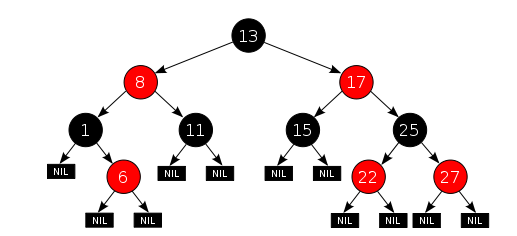
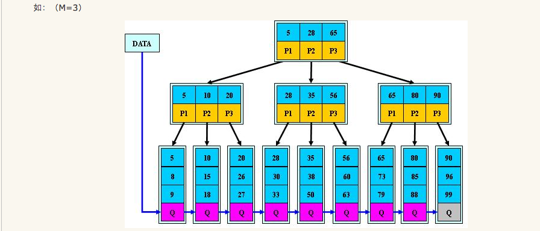

# 树

## 二叉树

L、D、R分别表示遍历左子树、访问根结点和遍历右子树

  - 先序遍历：DLR
  - 中序遍历：LDR
  - 后序遍历：LRD

> 仅有前序和后序遍历，不能确定一个二叉树，必须有中序遍历的结果

### 二叉树的性质

  - `性质1`：在二叉树中第 i 层的结点数最多为2^(i-1)（i ≥ 1）
  - `性质2`：高度为k的二叉树其结点总数最多为2^k－1（ k ≥ 1）
  - `性质3`：对任意的非空二叉树 T ，如果叶结点的个数为 n0，而其度为 2 的结点数为 n2，则：n0 = n2 + 1


### 满二叉树

深度为k，且有`2^k-1`个节点称之为`满二叉树`；

  - `性质4`：第i层上的节点数为`2^(i-1)`；

### 完全二叉树

深度为k，有n个节点的二叉树，当且仅当其每一个节点都与深度为k的满二叉树中，序号为1至n的节点对应时，称之为`完全二叉树`。

- `性质5`：对于具有n个结点的完全二叉树的高度为`log2(n)+1`

求完全二叉树的叶子结点个数：


### 二叉树的构造

```C
//n 表示当前结点字符
Node* tree(vector<char> data, int n) {

    Node* node;

    if (n >= data.size())
        return NULL;
    if (data[n] == '#')
        return NULL;

    node = new Node;
    node->data = data[n];

    node->left = tree(data, n + 1);
    node->right = tree(data, n + 2);
    return node;
}
```

## 堆

堆通常是一个可以被看做一棵树的数组对象。堆的实现通过构造二叉堆（binary heap），实为二叉树的一种；

  - 任意节点小于（或大于）它的所有后裔，最小元（或最大元）在堆的根上（堆序性）。
  - **堆总是一棵完全树**。即除了最底层，其他层的节点都被元素填满，且最底层尽可能地从左到右填入。

将根节点最大的堆叫做`最大堆`或大根堆，根节点最小的堆叫做`最小堆`或小根堆。常见的堆有二叉堆、斐波那契堆等。

通常堆是通过一维数组来实现的。在数组起始位置为1的情形中：

  - 父节点i的左子节点在位置`(2*i)`;
  - 父节点i的右子节点在位置`(2*i+1)`;
  - 子节点i的父节点在位置`(i/2)`;

## 霍夫曼树

霍夫曼树又称最优二叉树，**是一种带权路径长度最短的二叉树**。所谓树的带权路径长度，就是树中所有的叶结点的权值乘上其到根结点的路径长度（若根结点为0层，叶结点到根结点的路径长度为叶结点的层数）。**树的路径长度是从树根到每一结点的路径长度之和**，记为WPL=（W1*L1+W2*L2+W3*L3+...+Wn*Ln），N个权值Wi（i=1,2,...n）构成一棵有N个叶结点的二叉树，相应的叶结点的路径长度为Li（i=1,2,...n）。**可以证明霍夫曼树的WPL是最小的**。

### 霍夫曼树构造

  1. 根据给定的n个权值`(W1,W2...Wn)`，使对应节点构成n个二叉树的森林`T=(T1,T2...Tn)`，其中每个二叉树`Ti(1 <= i <= n)`中都有一个带权值为Wi的根节点，其左、右子树均为空。
  2. 在森林T中选取两个节点权值最小的子树，分别作为左、右子树构造一个新的二叉树，且置新的二叉树的根节点的权值为其左右子树上根节点权值之和。
  3. 在森林T中，用新得到的二叉树替代选取的两个二叉树。
  4. 重复2和3，直到T只包含一个树为止。这个数就是霍夫曼树。

>定理：对于具有n个叶子节点的霍夫曼树，共有`2n-1`个节点。这是由于霍夫曼树只有度为0和度为2的结点，根据二叉树的性质 `n0 = n2 + 1`，因此度为2的结点个数为`n-1`个，总共有`2n-1`个节点。

### 霍夫曼编码

对于一个霍夫曼树，所有左链接取'0'、右链接取'1'。从树根至树叶依序记录所有字母的编码。

### 带权路径

  - `结点的权`：若将树中结点赋给一个有着某种含义的数值，则这个数值称为该结点的权。
  - `结点的带权路径`：从根结点到该结点之间的路径长度与该结点的权的乘积。
  - `树的带权路径`：所有叶子结点的带权路径长度之和，记为`WPL`。


## 二叉排序树

二叉查找树，也称二叉搜索树、有序二叉树，排序二叉树，是指一棵空树或者具有下列性质的二叉树：

  - 任意节点的左子树不空，则左子树上所有结点的值均小于它的根结点的值；
  - 任意节点的右子树不空，则右子树上所有结点的值均大于它的根结点的值；
  - 任意节点的左、右子树也分别为二叉查找树；
  - 没有键值相等的节点。

二分查找的时间复杂度是O(log(n))，最坏情况下的时间复杂度是O(n)（相当于顺序查找）

## 平衡二叉树

平衡树是计算机科学中的一类改进的二叉查找树。一般的二叉查找树的查询复杂度是跟目标结点到树根的距离（即深度）有关，因此当结点的深度普遍较大时，查询的均摊复杂度会上升，为了更高效的查询，平衡树应运而生了。**平衡指所有叶子的深度趋于平衡，更广义的是指在树上所有可能查找的均摊复杂度偏低。**

### [AVL树](https://zh.wikipedia.org/wiki/AVL%E6%A0%91)

AVL树是最先发明的 **自平衡二叉查找树**。在AVL树中任何节点的两个子树的高度最大差别为一，所以它也被称为高度平衡树。

  - 它的左子树和右子树都是平衡二叉树。
  - 左子树和右子树的深度之差的绝对值不超过1。

增加和删除可能需要通过一次或多次树旋转来重新平衡这个树。

  - 右旋：左结点转到根节点位置。
  - 左旋：右节点转到根节点位置。

> 高度为`k`的AVL树，节点数N最多`2^k -1`，即满二叉树；

### 红黑树

红黑树是一种自平衡二叉查找树，每个节点都带有颜色属性的二叉查找树，颜色为红色或黑色。在二叉查找树强制一般要求以外，对于任何有效的红黑树我们增加了如下的额外要求：

  - 节点是红色或黑色。
  - 根是黑色。
  - 所有叶子都是黑色（叶子是NIL节点）。
  - 每个红色节点必须有两个黑色的子节点。（从每个叶子到根的所有路径上不能有两个连续的红色节点。）
  - 从任一节点到其每个叶子的所有简单路径都包含相同数目的黑色节点。

  >如果一条路径上的顶点除了起点和终点可以相同外，其它顶点均不相同，则称此路径为一条简单路径；起点和终点相同的简单路径称为回路（或环）。




>红黑树相对于AVL树来说，牺牲了部分平衡性以换取插入/删除操作时少量的旋转操作，整体来说性能要优于AVL树。

这些约束确保了红黑树的关键特性：**从根到叶子的最长的可能路径不多于最短的可能路径的两倍长**。结果是这个树大致上是平衡的。因为操作比如插入、删除和查找某个值的最坏情况时间都要求与树的高度成比例，这个在高度上的理论上限 **允许红黑树在最坏情况下都是高效的**，而不同于普通的二叉查找树。

在很多树数据结构的表示中，一个节点有可能只有一个子节点，而叶子节点包含数据。用这种范例表示红黑树是可能的，但是这会改变一些性质并使算法复杂。为此，本文中我们使用"nil叶子"或"空（null）叶子"，如上图所示，它不包含数据而只充当树在此结束的指示。**这些节点在绘图中经常被省略，导致了这些树好像同上述原则相矛盾，而实际上不是这样**。与此有关的结论是所有节点都有两个子节点，尽管其中的一个或两个可能是空叶子。

因为每一个红黑树也是一个特化的二叉查找树，因此红黑树上的只读操作与普通二叉查找树上的只读操作相同。然而，在红黑树上进行插入操作和删除操作会导致不再符合红黑树的性质。**恢复红黑树的性质需要少量（O(log n)）的颜色变更（实际是非常快速的）和不超过三次树旋转（对于插入操作是两次）**。虽然插入和删除很复杂，但操作时间仍可以保持为O(log n)次。


## B树

是一种多路搜索树（并不是二叉的）：

  1. 所有叶子结点位于同一层，并且 **不带信息**。
  2. 树中每个节点最多有m个子树(即至多含有m-1个关键字)。
  3. 若根节点不是终端节点，则根节点子树[2,m].
  4. 除根节点外其他非叶子节点至少有[m/2]个子树(即至少含有[m/2]-1个关键字)。
  5. 每个非叶子节点的结构为：

  | n | p0 | k1 | p1 | k2 | p2 | ... | kn | pn |
  >n为该节点中的关键字个数，除根节点外，其他所有非叶子节点的关键字个数n：[m/2]-1 <= n <= m-1;

  >ki(i <= i <=n)为该节点的关键字且满足ki < ki+1

  >pi(0 <= i <=n)为该节点的孩子节点指针pi(0 <= i <=n-1)所指节点上的关键字大于等于ki且小于ki+1，pn所指节点上的关键字大于kn.

>B树的阶：所有节点的孩子节点数的最大值


### B树的查找

在B树中的查找给定关键字的方法 **类似于二叉排序树上的查找，不同的是在每个节点上确定向下查找的路径不一定是二路的，而是n+1路的**。因为节点内的关键字序列key[1..n]有序，故既可以使用顺序查找，也可以使用二分查找。在一棵B树上查找关键字为k的方法为：将k与根节点中的key[i]进行比较：
  1. 若k=key[i]，则查找成功；
  2. 若k<key[1]，则沿指针ptr[0]所指的子树继续查找；
  3. 若key[i]<k<key[i+1]，则沿着指针ptr[i]所指的子树继续查找；
  4. 若k>key[n]，则沿着指针ptr[n]所指的子树继续查找。

### B树的插入

将关键字k插入到B树的过程分两步完成：

  1. 利用B树的查找算法查找出该关键字的插入节点(注意B树的插入节点一定属于最低非叶子节点层)。

  2. 判断该节点是否还有空位，即判断该节点是否满足n < m-1，若满足：直接把关键字k插入到该节点合适位置上；若不满足：分裂节点，取一新节点，把原节点上的关键字和k按升序排列后，从中间位置(m/2)处把关键字(不包括中间位置的关键字)分成两部分，左部分所含关键字放在旧节点中，右部分关键字放在新节点中，中间位置的关键字连同新节点的存储位置插入到双亲节点。如果双亲节点的关键字个数也超出max则再分裂。

### B树的删除

首先查找B树中需删除的元素，如果该元素在B树中存在，则将该元素在其结点中进行删除；如果删除该元素后，首先判断该元素是否有左右孩子结点，如果有，则上移孩子结点中的某相近元素到父节点中，然后是移动之后的情况；如果没有，直接删除后，然后是移动之后的情况。

删除元素，移动相应元素之后，如果某结点中元素数目（即关键字数）小于Min(m/2)-1，则需要看其某相邻兄弟结点是否丰满，如果丰满，则向父节点借一个元素来满足条件；如果其相邻兄弟都刚脱贫，即借了之后其结点数目小于Min(m/2)-1，则该结点与其相邻的某一兄弟结点进行“合并”成一个结点，


## B+树
是一种自平衡二叉树，通常用于数据库和操作系统的文件系统中。B+树的特点是能够保持数据稳定有序，其插入与修改拥有较稳定的对数时间复杂度。B+树元素自底向上插入，这与二叉树恰好相反。**B+树不需要象其他自平衡二叉查找树那样经常的重新平衡。**



B+树是B树的变体，也是一种多路搜索树：

  1. 每个分支节点 **最多m个子树**
  2. 根节点没有子树或至少两个子树
  3. 除根节点外，其他 **每个分支节点至少[m/2]个子树**
  4. 有n个子树的节点有n个关键字
  5. 所有叶子节点包含全部关键字及指向相应记录的指针，而且叶子节点按关键字大小顺序链接(可以把每个叶子及诶单看成一个基本索引块，它的指针不再指向另一级索引块，而是直接指向数据文件中的记录)
  6. 所有分支节点中仅仅包含它的哥哥子节点(即下级索引块)中最大关键字及指向子节点的指针。

m阶的B+树和B树的主要差异如下：

  - 在B+树中，具有n个关键字的节点含有n个子树，即每个关键字对应一个子树，而在B树中，具有n个关键字的节点含有(n+1)个子树。
  - 在B+树中，每个节点(除根节点外)中的关键字个数n的取值范围是[m/2] <= n <= m，根节点n的取值范围2 <=n <=m；而在B树中，除根节点外，其他所有非叶子节点的关键字个数：[m/2]-1 <= n <= m-1，根节点关键字个数为1 <= n <= m-1
  - **B+树中所有叶子节点包含了全部关键字，即其他非叶子节点中的关键字包含在叶子节点中，而在B树中，关键字是不重复的。**
  - **B+树中所有非叶子节点仅起到索引的作用**，即节点中每个索引项值含有对应子树的最大关键字和指向该子树的指针，不含有该关键字对应记录的存储地址。而在B树中，每个关键字对应一个记录的存储地址。
  - 通常B+树上有两个头指针，一个指向根节点，另一个指向关键字最小的叶子节点，所有叶子节点链接成一个不定长的线性表。


### B+树的查找

在B+树中可以采用两种查找方式：

  - 直接从最小关键字开始顺序查找。
  - 从B+树的根节点开始随机查找。这种查找方式与B树的查找方式类似，只是在分支节点上的关键字与查找值相等时，查找并不会结束，要继续查到叶子节点为止，此时若查找成功，则按所给指针取出对应元素。

在B+树中，不管查找是否成功，**每次查找都是经历一条树从根节点到叶子节点的路径**。

### B+树的插入

  1. 首先，查找要插入其中的节点的位置。接着把值插入这个节点中。
  2. 如果没有节点处于违规状态则处理结束。
  3. 如果某个节点有过多元素，则把它分裂为两个节点，每个都有最小数目的元素。在树上递归向上继续这个处理直到到达根节点，如果根节点被分裂，则创建一个新根节点。为了使它工作，元素的最小和最大数目典型的必须选择为使最小数不小于最大数的一半。

### B+树的删除

  1. 首先，查找要删除的值。接着从包含它的节点中删除这个值。
  2. 如果没有节点处于违规状态则处理结束。
  3. 如果节点处于违规状态则有两种可能情况：
       - 它的兄弟节点，可以把一个或多个它的子节点转移到当前节点，而把它返回为合法状态。如果是这样，在更改父节点和两个兄弟节点的分离值之后处理结束。
       - 它的兄弟节点由于处在低边界上而没有额外的子节点。在这种情况下把两个兄弟节点合并到一个单一的节点中，而且我们递归到父节点上，因为它被删除了一个子节点。持续这个处理直到当前节点是合法状态或者到达根节点，在其上根节点的子节点被合并而且合并后的节点成为新的根节点。

> B树和B+树 主要用于外部查找，即数据在外存中。

### B+树的优势所在

为什么说B+树比B树更适合实际应用中操作系统的文件索引和数据库索引？

  1. B+树的中间节点能存储更多指针
  2. **B+树的查询效率更加稳定**：关键字查询的路径长度相同
  3. **减少回溯**：由于B+树中叶子节点存在指针，所以在范围查找时不需要回溯到父节点，直接类型链表遍历即可，减少IO

## Trie树

`Trie树`，又称前缀树，`字典树`， 是一种有序树，用于保存关联数组，其中的键通常是字符串。与二叉查找树不同，键不是直接保存在节点中，而是由节点在树中的位置决定。**一个节点的所有子孙都有相同的前缀，也就是这个节点对应的字符串，而根节点对应空字符串**。一般情况下，不是所有的节点都有对应的值，只有叶子节点和部分内部节点所对应的键才有相关的值。

**Trie树查询和插入时间复杂度都是 O(n)，是一种以空间换时间的方法。当节点树较多的时候，Trie 树占用的内存会很大**。

Trie树常用于搜索提示。如当输入一个网址，可以自动搜索出可能的选择。当没有完全匹配的搜索结果，可以返回前缀最相似的可能。
