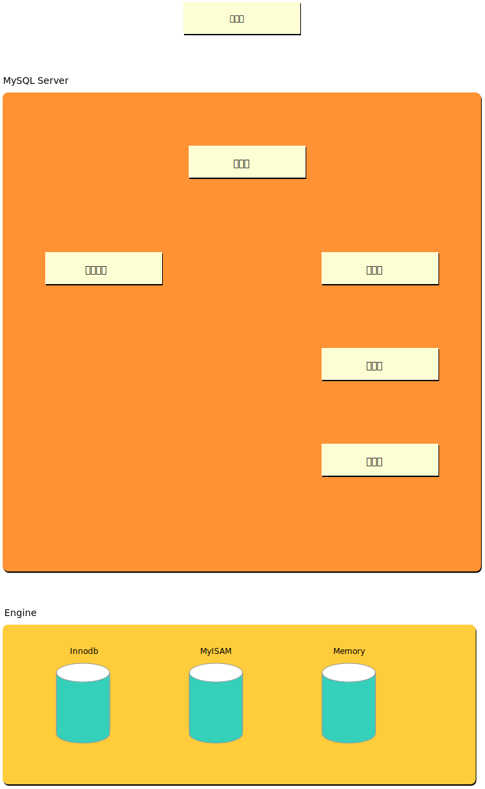
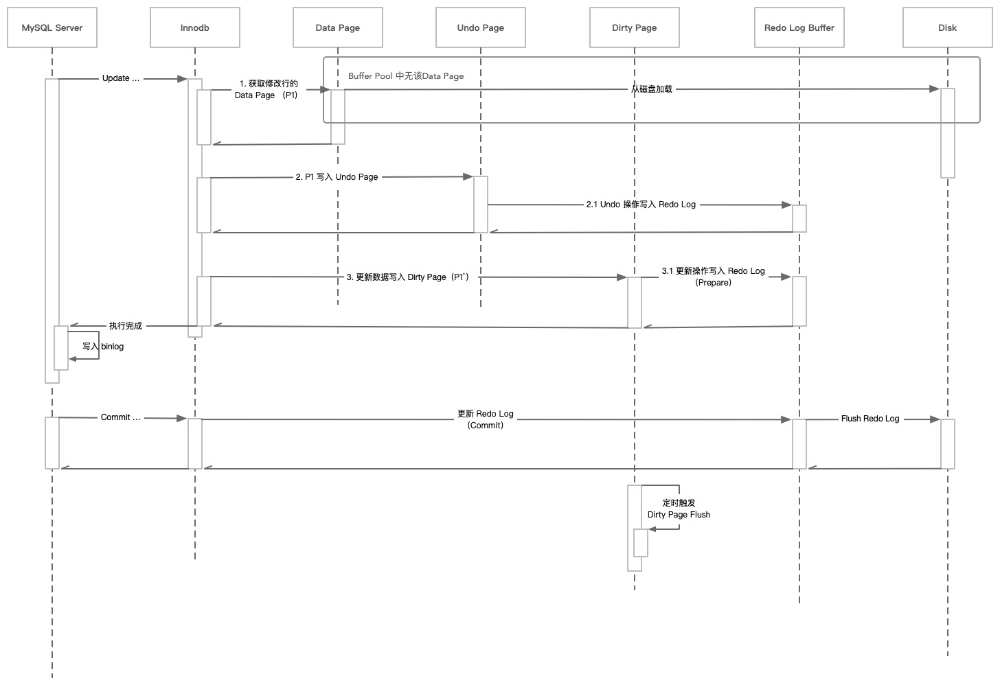

# MySQL 架构

总体来说 MySQL 可以分为两层，第一层是 MySQL 的服务层，包含 MySQL 核心服务功能：解析、分析、优化、缓存以及内置函数，所有跨存储引擎的功能都在这一层实现：存储过程、触发器、视图等。

第二层是 MySQL 的 **存储引擎层**，MySQL 中可使用多种存储引擎：Innodb、MyISAM、Memory。存储引擎负责 MySQL 中数据的存取。服务层通过统一的 API 与存储引擎进行通信，这些 API 屏蔽来同步存储引擎之间的差异，使得这些差异对上层的查询过程透明。

## MySQL Server

### 连接器

连接器负责跟客户端建立连接、获取权限、维持和管理连接。

### 查询缓存

查询缓存将查询结果按 K-V 的形式进行缓存，K 是查询的语句，V 是查询的结果。当一个表发生更新后，该表对应的所有缓存均会失效。

### 分析器

分析器有两个功能：**词法分析**、**语法分析**。对于一个 SQL 语句，分析器首先进行词法分析，对 SQL 语句进行拆分，识别出各个字符串代表的含义。然后就是语法分析，分析器根据定义的语法规则判断 SQL 是否满足 MySQL 语法。

### 优化器

优化器在获取到分析器的结果后，通过表结构和 SQL 语句选择执行方案，比如：多表关联时，各个表如何进行连接；当表中有索引时，应该怎样选择索引 等等。

### 执行器

获取到执行方案后，执行器就会根据表的引擎定义，去使用这个引擎提供的接口。在进行查询时，MySQL 执行器内部执行步骤如下：

1. 调用引擎接口取这个表的第一行，判断该行是否满足 WHERE 子句，如果满足则将这行存在结果集中，否则跳过。
2. 调用引擎接口取下一行，重复相同的判断逻辑，直到取到这个表的最后一行。
3. 执行器将上述遍历过程中所有满足条件的行组成的记录集作为结果集返回给客户端。

对于走索引的查询，执行的逻辑也差不多。第一次调用的是 *取满足条件的第一行* 这个接口，之后循环取 *满足条件的下一行* 这个接口，这些接口都是引擎中已经定义好的。

### Update 处理逻辑

这里简单的分析下 Update 的处理逻辑

1. MySQL Server 发送更新请求到 Innodb 引擎
2. 从 Buffer Pool 加载对应记录的 Data Page（P1）
   1. 若 Buffer Pool 中没有该记录，则从磁盘加载该记录
3. 将 P1 存储到 Undo Page 中，并在 Redo Log Buffer 中记录 Undo 操作
4. 更新 P1 为 P1' ，并将 P1' 写入 Dirty Page ，记录变更到 Redo Log Buffer（Prepare 状态）
5. 返回 MySQL Server 执行完成
6. MySQL Server 记录 binlog
7. MySQL Server 提交 Commit
8. Redo Log Buffer 状态有 Prepare 更改为 Commit，并刷入磁盘
9. 当 Dirty Page 过多时，启动 ChcekPoint 机制，将脏页刷入磁盘
