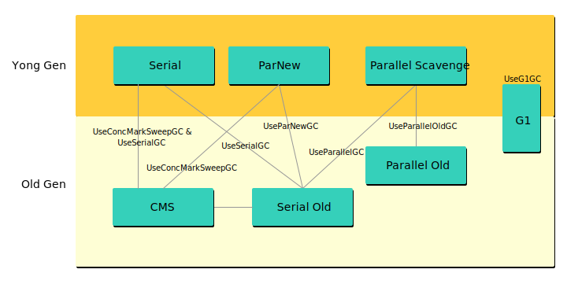

# 垃圾回收

## 对象存活检测

Java堆中存放着大量的Java对象实例，在垃圾收集器回收内存前，第一件事情就是确定哪些对象是活着的，哪些是可以回收的。

### 引用计数算法

引用计数算法是判断对象是否存活的基本算法：给每个对象添加一个引用计数器，没当一个地方引用它的时候，计数器值加1；当引用失效后，计数器值减1。但是这种方法有一个致命的缺陷，**当两个对象相互引用时会导致这两个都无法被回收**。

### 根搜索算法

引用计数是通过为堆中每个对象保存一个计数来区分活动对象和垃圾。根搜索算法实际上是追踪从根结点开始的 **引用图**。

在根搜索算法追踪的过程中，起点即 **GC Root**，GC Root 根据 JVM 实现不同而不同，但是总会包含以下几个方面：
  - 虚拟机栈（栈帧中的本地变量表）中引用的对象。
  - 方法区中的类静态属性引用的变量。
  - 方法区中的常量引用的变量。
  - 本地方法 JNI 的引用对象。

根搜索算法是从 GC Root 开始的引用图，引用图是一个有向图，其中节点是各个对象，边为引用类型。JVM 中的引用类型分为四种：**强引用（StrongReference）**、**软引用（SoftReference）**、**弱引用（WeakReference）** 和 **虚引用（PhantomReference）**。

除强引用外，其他引用在Java 由 `Reference` 的子类封装了指向其他对象的连接：被指向的对象称为 **引用目标**。

若一个对象的引用类型有多个，那到底如何判断它的回收策略呢？其实规则如下：
  - 单条引用链以链上最弱的一个引用类型来决定；
  - 多条引用链以多个单条引用链中最强的一个引用类型来决定；

在引用图中，当一个节点没有任何路径可达时，我们认为它是可回收的对象。

#### StrongReference

强引用在Java中是普遍存在的，类似 `Object o = new Object();` 。强引用和其他引用的区别在于：**强引用禁止引用目标被垃圾收集器收集，而其他引用不禁止**。

#### SoftReference

对象可以从根节点通过一个或多个(未被清除的)软引用对象触及，垃圾收集器在要发生内存溢出前将这些对象列入回收范围中进行回收，如果该软引用对象和引用队列相关联，它会把该软引用对象加入队列。

**JVM 的实现需要在抛出 OutOfMemoryError 之前清除 SoftReference**，但在其他的情况下可以选择清理的时间或者是否清除它们。

#### WeakReference

对象可以从 GC Root 开始通过一个或多个(未被清除的)弱引用对象触及， **垃圾收集器在 GC 的时候会回收所有的 WeakReference**，如果该弱引用对象和引用队列相关联，它会把该弱引用对象加入队列。

#### PhantomReference

**垃圾收集器在 GC 不会清除 PhantomReference，所有的虚引用都必须由程序明确的清除**。同时也不能通过虚引用来取得一个对象的实例。

## 垃圾回收算法

### 复制回收算法

将可用内存分为大小相等的两份，在同一时刻只使用其中的一份。当这一份内存使用完了，就将还存活的对象复制到另一份上，然后将这一份上的内存清空。复制算法能有效避免内存碎片，但是算法需要将内存一分为二，导致内存使用率大大降低。

### 标记清除算法

先暂停整个程序的全部运行线程，让回收线程以单线程进行扫描标记，并进行直接清除回收，然后回收完成后，恢复运行线程。**标记清除后会产生大量不连续的内存碎片**，造成空间浪费。

### 标记整理算法

和 *标记清除* 相似，不同的是，回收期间同时会将保留的存储对象搬运汇集到连续的内存空间，从而集成空闲空间。

### 增量回收

需要程序将所拥有的内存空间分成若干分区（Region）。程序运行所需的存储对象会分布在这些分区中，每次只对其中一个分区进行回收操作，从而避免程序全部运行线程暂停来进行回收，允许部分线程在不影响回收行为而保持运行，并且降低回收时间，增加程序响应速度。

### 分代回收

在 JVM 中不同的对象拥有不同的生命周期，因此对于不同生命周期的对象也可以采用不同的垃圾回收算法，以提高效率，这就是分代回收算法的核心思想。

## 垃圾回收触发条件

### 堆内内存

针对 HotSpot VM 的实现，它里面的 GC 其实准确分类只有两大种：
1. **Partial GC**：并不收集整个 GC 堆的模式
   1. **Young GC（Minor GC）**：只收集 Young Gen 的 GC
   2. **Old GC**：只收集 Old Gen 的 GC。只有 CMS的 Concurrent Collection 是这个模式
   3. **Mixed GC**：收集整个 Young Gen 以及部分 Old Gen 的 GC。只有 G1 有这个模式
2. **Full GC（Major GC）**：收集整个堆，包括 Young Gen、Old Gen、Perm Gen（如果存在的话）等所有部分的 GC 模式。

最简单的分代式GC策略，按 HotSpot VM 的 serial GC 的实现来看，触发条件是

- **Young GC**：当 Young Gen 中的 eden 区分配满的时候触发。把 Eden 区存活的对象将被复制到一个 Survivor 区，当这个 Survivor 区满时，此区的存活对象将被复制到另外一个 Survivor 区。
- **Full GC**：
  - 当准备要触发一次 Young GC 时，如果发现之前 Young GC 的平均晋升大小比目前 Old Gen剩余的空间大，则不会触发 Young GC 而是转为触发 Full GC
    > 除了 CMS 的 Concurrent Collection 之外，其它能收集 Old Gen 的GC都会同时收集整个 GC 堆，包括 Young Gen，所以不需要事先触发一次单独的Young GC
  - 如果有 Perm Gen 的话，要在 Perm Gen分配空间但已经没有足够空间时
  - `System.gc()`
  - Heap dump

并发 GC 的触发条件就不太一样。以 CMS GC 为例，它主要是定时去检查 Old Gen 的使用量，当使用量超过了触发比例就会启动一次 GC，对 Old Gen做并发收集。

### 堆外内存

`DirectByteBuffer` 的引用是直接分配在堆得 `Old` 区的，因此其回收时机是在 `FullGC` 时。因此，需要避免频繁的分配 `DirectByteBuffer` ，这样很容易导致 `Native Memory` 溢出。

`DirectByteBuffer` 申请的直接内存，不再GC范围之内，无法自动回收。JDK 提供了一种机制，可以为堆内存对象注册一个钩子函数(其实就是实现 `Runnable` 接口的子类)，当堆内存对象被GC回收的时候，会回调run方法，我们可以在这个方法中执行释放 `DirectByteBuffer` 引用的直接内存，即在run方法中调用 `Unsafe` 的 `freeMemory` 方法。注册是通过`sun.misc.Cleaner` 类来实现的。

## 垃圾收集器

垃圾收集器是内存回收的具体实现，下图展示了 7 种用于不同分代的收集器，两个收集器之间有连线表示可以搭配使用，每种收集器都有最适合的使用场景。

### Serial 收集器

Serial 收集器是最基本的收集器，这是一个单线程收集器，它只用一个线程去完成垃圾收集工作。

虽然 Serial 收集器的缺点很明显，但是它仍然是 JVM 在 Client 模式下的默认新生代收集器。它有着优于其他收集器的地方：简单而高效（与其他收集器的单线程比较），Serial 收集器由于没有线程交互的开销，专心只做垃圾收集自然也获得最高的效率。在用户桌面场景下，分配给 JVM 的内存不会太多，停顿时间完全可以在几十到一百多毫秒之间，只要收集不频繁，这是完全可以接受的。

### ParNew 收集器

ParNew 是 Serial 的多线程版本，在回收算法、对象分配原则上都是一致的。ParNew 收集器是许多运行在Server 模式下的默认新生代垃圾收集器，其主要与 CMS 收集器配合工作。

### Parallel Scavenge 收集器

Parallel Scavenge 收集器是一个新生代垃圾收集器，也是并行的多线程收集器。

Parallel Scavenge 收集器更关注可控制的吞吐量，吞吐量等于运行用户代码的时间/(运行用户代码的时间+垃圾收集时间)。

### Serial Old收集器

Serial Old 收集器是 Serial 收集器的老年代版本，也是一个单线程收集器，采用“标记-整理算法”进行回收。

### Parallel Old 收集器

Parallel Old 收集器是 Parallel Scavenge 收集器的老年代版本，使用多线程进行垃圾回收，其通常与 Parallel Scavenge 收集器配合使用。

### CMS 收集器

CMS（Concurrent Mark Sweep）收集器是一种以获取最短停顿时间为目标的收集器， CMS 收集器采用 `标记--清除` 算法，运行在老年代。主要包含以下几个步骤：

  - 初始标记
  - 并发标记
  - 重新标记
  - 并发清除

其中初始标记和重新标记仍然需要 **Stop the world**。初始标记仅仅标记 GC Root 能直接关联的对象，并发标记就是进行 GC Root Tracing 过程，而重新标记则是为了修正并发标记期间，因用户程序继续运行而导致标记变动的那部分对象的标记记录。

由于整个过程中最耗时的并发标记和并发清除，收集线程和用户线程一起工作，所以总体上来说， CMS 收集器回收过程是与用户线程并发执行的。虽然 CMS 优点是并发收集、低停顿，很大程度上已经是一个不错的垃圾收集器，但是还是有三个显著的缺点：

  - **CMS收集器对CPU资源很敏感**：在并发阶段，虽然它不会导致用户线程停顿，但是会因为占用一部分线程（CPU资源）而导致应用程序变慢。

  - **CMS收集器不能处理浮动垃圾**：所谓的“浮动垃圾”，就是在并发标记阶段，由于用户程序在运行，那么自然就会有新的垃圾产生，这部分垃圾被标记过后，CMS 无法在当次集中处理它们，只好在下一次 GC 的时候处理，这部分未处理的垃圾就称为“浮动垃圾”。

  - **GC 后产生大量内存碎片**：当内存碎片过多时，将会给分配大对象带来困难，这是就会进行 Full GC。

正是由于在垃圾收集阶段程序还需要运行，即还需要预留足够的内存空间供用户使用，因此 CMS 收集器不能像其他收集器那样等到老年代几乎填满才进行收集，需要预留一部分空间提供并发收集时程序运作使用。要是 CMS 预留的内存空间不能满足程序的要求，这是 JVM 就会启动预备方案：**临时启动 Serial Old 收集器来收集老年代**，这样停顿的时间就会很长。

### G1收集器

G1收集器与CMS相比有很大的改进：

  - **标记整理算法**：G1 收集器采用标记整理算法实现
  - **增量回收模式**：将 Heap 分割为多个 Region，并在后台维护一个优先列表，每次根据允许的时间，优先回收垃圾最多的区域

因此 G1 收集器可以实现在基本不牺牲吞吐量的情况下完成低停顿的内存回收，这是正是由于它极力的避免全区域的回收。

|垃圾收集器|特性|算法|优点|缺点|
|:--|:--|:--|:--|:--|
|Serial|串行|复制|高效：无线程切换|无法利用多核CPU|
|ParNew|并行|复制|可利用多核CPU、唯一能与CMS配合的并行收集器||
|Parallel Scavenge|并行|复制|高吞吐量||
|Serial Old|串行|标记整理|高效|无法利用多核CPU|
|Parallel Old|并行|标记整理|高吞吐量|
|CMS|并行|标记清除|低停顿|CPU敏感、浮动垃圾、内存碎片|
|G1|并行|增量回收|低停顿、高吞吐量|内存使用效率低：分区导致内存不能充分使用|